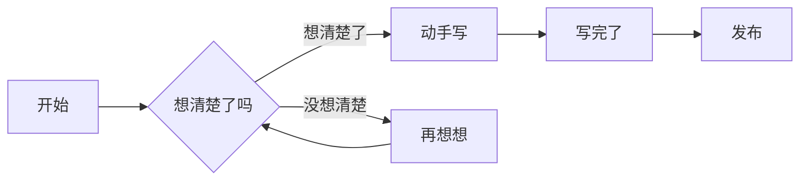
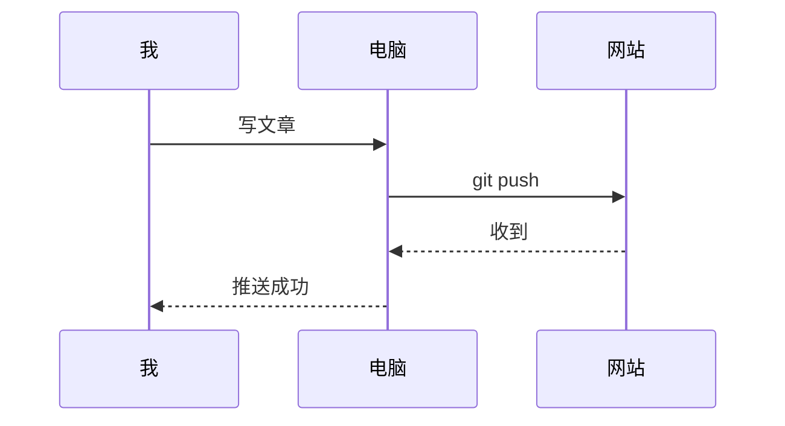

> [!IMPORTANT]
> **这是一篇格式示范，内容全是占位符，不是真文章。**
> 写自己的文章时：复制这篇的**结构**，把文字换成你的内容。
> 不需要了就直接删掉这个文件（`src/content/posts/demo-post.md`）。

---

## 🧭 怎么用这篇示例

| 你想做什么 | 看哪一节 |
|---|---|
| 知道文章开头那段"信息"怎么写 | [一、文章头信息](#一文章头信息frontmatter) |
| 写普通文字、加粗、斜体、链接 | [二、基本文字](#二基本文字) |
| 列清单（含打勾的待办清单） | [三、列表](#三列表) |
| 引用别人的话、加警告框 | [四、引用与提示框](#四引用与提示框) |
| 放代码 | [五、代码块](#五代码块) |
| 放表格 | [六、表格](#六表格) |
| 正文里插图 | [七、图片](#七图片) |
| 写数学公式 | [八、数学公式](#八数学公式) |
| 画流程图 | [九、流程图](#九流程图) |
| 其他零碎技巧 | [十、零碎技巧](#十零碎技巧) |

---

## 一、文章头信息（Frontmatter）

打开任何一篇 `.md` 文件，最上面被两行 `---` 夹住的部分就是**文章头信息**，用来说明"这篇是什么"。

```markdown
---
title: 文章标题
published: 2026-10-01
description: 一句话简介，会显示在文章列表的卡片上
tags: [标签一, 标签二]
category: 学习笔记
image: ./images/封面图.avif
---
```

**每个字段是什么意思：**

| 字段 | 必填？ | 说明 |
|---|---|---|
| `title` | ✅ **必填** | 文章标题，显示在列表和浏览器标签页上 |
| `published` | ✅ **必填** | 发布日期，格式必须是 `2026-10-01` 这样 |
| `description` | 选填 | 一句话简介，显示在文章卡片的标题下面 |
| `tags` | 选填 | 标签，写成 `[标签一, 标签二]` 这样 |
| `category` | 选填 | 分类，一篇只能有一个 |
| `image` | 选填 | 封面图，**不写就不显示封面图** |
| `draft` | 选填 | 写 `true` = 草稿，不会发布（写一半可以先这样） |
| `pinned` | 选填 | 写 `true` = 在列表里置顶 |
| `slug` | 选填 | 自定义网址，不写就用文件名 |
| `series` | 选填 | 系列名，把多篇文章串成一个系列 |
| `seriesOrder` | 选填 | 在这个系列里排第几 |

> [!TIP]
> **文件名会成为网址的一部分。** 比如这个文件叫 `demo-post.md`，网址就是
> `https://0721zhang.github.io/posts/demo-post/`
> 建议文件名用英文，别用中文和空格。

---

## 二、基本文字

这是一段普通文字。**这是加粗**，*这是斜体*，~~这是删除线~~，`这是行内代码`。

想换行但不想另起一段，在行末加两个空格（或者直接空一行写下一段）。

**超链接**：这样写 —— 微软官方的 [Markdown 语法说明](https://learn.microsoft.com/zh-cn/)，鼠标放上去有提示的可以这样写 [百度](https://www.baidu.com "这是鼠标悬停时的提示文字")。

**关于网址自动识别**：直接写网址 <https://astro.build> 会自动变成链接，不用加中括号。

这一行下面会有一条水平分割线：

---

## 三、列表

**无序列表**（前面是圆点）：

- 第一项
- 第二项
  - 这是嵌套的小项（前面多两个空格）
  - 再来一个小项
- 第三项

**有序列表**（自动编号）：

1. 第一步：想清楚要写什么
2. 第二步：把内容写出来
   1. 可以先写大纲
   2. 再填细节
3. 第三步：检查错别字

**待办清单**（可以打勾的那种）：

- [x] 已完成的事（方括号里写 x）
- [ ] 还没做的事（方括号里写空格）
- [ ] 另一件待办

---

## 四、引用与提示框

**普通引用**：别人说的话、名言、强调内容

> 我推过的地方，就是路。我路过的地方，就是风景。

**提示框**：主题内置了 5 种，写法和引用一样，只是在开头加 `[!类型]`

> [!NOTE]
> 这是「注意」框 —— 蓝色的，用来补充说明。

> [!TIP]
> 这是「技巧」框 —— 绿色的，用来给个小建议。

> [!IMPORTANT]
> 这是「重要」框 —— 紫色的，用来强调关键信息。

> [!WARNING]
> 这是「警告」框 —— 黄色的，用来提醒可能出错的地方。

> [!CAUTION]
> 这是「小心」框 —— 红色的，用来提示危险操作。

---

## 五、代码块

**基础用法**：三个反引号开头，后面写上语言名（会高亮）。

```python
def greet(name):
    """一个简单的打招呼函数"""
    return f"你好，{name}！"

if __name__ == "__main__":
    print(greet("世界"))
```

**带文件名的代码块**（在语言后面加 `title="文件名"`）：

```bash title="终端"
cd /d/blog
git status
```

**高亮某几行**（大括号里写行号，`4` 是单行，`7-8` 是范围）：

```js {4, 7-8}
// 这是第 1 行
// 这是第 2 行
// 这是第 3 行
console.log("第 4 行会被高亮加背景色"); // 高亮
// 这是第 5 行
// 这是第 6 行
console.log("第 7 行也高亮"); // 高亮
console.log("第 8 行也高亮"); // 高亮
```

**标签页代码块**（多个版本放一起，点击切换）：

::: code-group labels=[JavaScript, Python, Java]

```js
function greet(name) {
  return `你好，${name}！`;
}
```

```py
def greet(name):
    return f"你好，{name}！"
```

```java
public String greet(String name) {
    return "你好，" + name + "！";
}
```

:::

**行内代码**：`像这样写一小段代码`

---

## 六、表格

用竖线 `|` 分隔列，第二行的 `---` 是分隔线（必须写）。

| 语法 | 效果 | 备注 |
|---|---|---|
| `**文字**` | **加粗** | 两边各两个星号 |
| `*文字*` | *斜体* | 两边各一个星号 |
| `` `代码` `` | `代码` | 两边各一个反引号 |
| `~~文字~~` | ~~删除线~~ | 两边各两个波浪号 |

**对齐方式**（第二行的冒号位置决定）：

| 左对齐 | 居中对齐 | 右对齐 |
|:---|:---:|---:|
| 默认 | 两边加冒号 | 右边加冒号 |
| 左 | 中 | 右 |
| 100 | 200 | 300 |

---

## 七、图片

**正文里插图**，用感叹号开头，方括号里是说明文字（图片加载失败时会显示它）：

```markdown

```

上面这行的意思是：图片放在**和文章同一个文件夹下的 `images` 目录**里。

> [!TIP]
> 所有文章的图片都放 `src/content/posts/images/` 这一个目录就行，不用每篇文章单独建文件夹。
> 主题会自动把图片转成更小的格式（webp/avif），**你不需要自己压缩**，但原图别超过 500 KB。

**想给图片加说明文字**（显示在图片下方），在图片下一行单独写一个斜体段落：

```markdown

*↑ 这段会显示在图片下方，成为图注*
```

---

## 八、数学公式

主题内置了公式支持（KaTeX）。**行内公式**用一对美元符号：

质能方程 $E = mc^2$，勾股定理 $a^2 + b^2 = c^2$。

**独立成行的公式**用两对美元符号，会**居中单独占一行**：

$$
\frac{n!}{k!(n-k)!} = \binom{n}{k}
$$

$$
\sum_{i=1}^{n} i = \frac{n(n+1)}{2}
$$

**化学方程式**也能写（用了 mhchem 扩展）：

$$
\ce{2H2 + O2 -> 2H2O}
$$

$$
\ce{CO2 + H2O <=> H2CO3}
$$

> [!NOTE]
> 这个功能对你的加密实验笔记可能有用（写算法公式、复杂度什么的）。
> 输入符号表示法：下标 `_`、上标 `^`、分数 `\frac{分子}{分母}`、求和 `\sum`。

---

## 九、流程图

用 `mermaid` 开头的代码块可以**画流程图**，主题会在构建时把它渲染成图片。



**时序图**：



---

## 十、零碎技巧

**1. 标题会自动生成目录**

用 `##` 开头写标题时，网页右侧（或文章顶部）会自动生成目录，能点击跳转。所以**标题层级别乱跳**（比如 `##` 下面直接跟 `####`）。

**2. 折叠区域**

内容太多想收起来的话，可以做成可折叠的块：

::: details 点我展开看内容
这里是折叠起来的内容，默认不显示，点击标题才展开。
:::

**3. 文章里引用另一篇文章**

用链接就行：

```markdown
[另一篇文章的标题](/posts/那篇文章的网址/)
```

**4. 那些"无效"的空格**

Markdown 里，**中文和英文之间的空格是不显示的**，所以你不用纠结排版对齐 —— 段落会自动换行适应屏幕宽度，不用手动敲回车。

**5. 写错了想撤销**

没发布之前随便改，改坏了就：

```bash
cd /d/blog
git checkout -- "src/content/posts/你改坏的文件.md"
```

---

## 十一、写完检查清单

发布前对着这个走一遍：

- [ ] `title` 和 `published` 填了（**必填**，不填构建会报错）
- [ ] `draft: true` 记得删掉（不然不会发布）
- [ ] 本地预览看过了（`corepack pnpm dev`，打开 http://127.0.0.1:4321）
- [ ] 图片能正常显示
- [ ] 文件名是英文的

---

*本文是格式模板，学会了就可以删掉它。*

*建立日期：2026-10-01*
